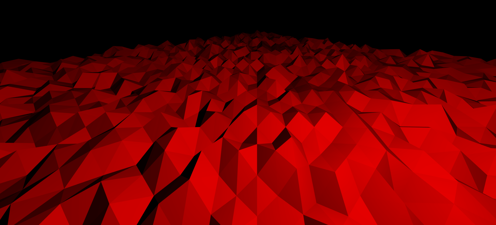
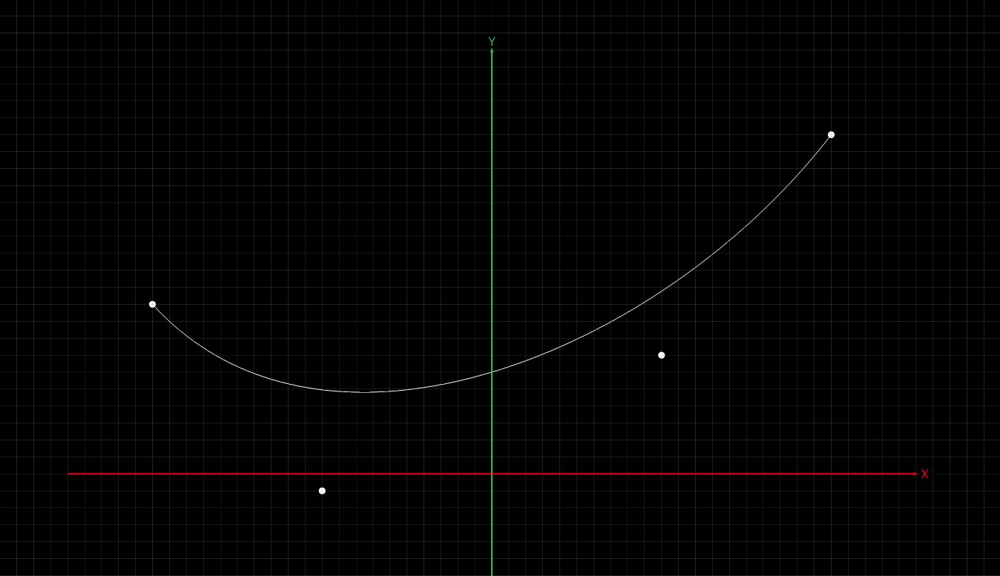
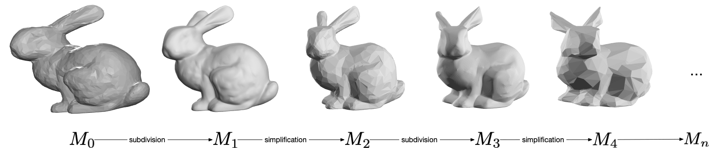

# Computer Graphics - Summer Semester 2020

This repository contains code skeletons for coding assignments. 
For more details, see the course website: [mimuc.de/cg1](http://mimuc.de/cg1).

## Tools

The following lists tools are used in the tutorials.

- [Node.js](https://nodejs.org/)
- [three.js](https://threejs.org/)
- [OpenGL](https://www.opengl.org/)
- [Chrome](https://www.google.com/chrome/)
- [Typora](https://typora.io/)
- [VS Code](https://code.visualstudio.com/)

## Code Skeletons

| Task | Picture | Live Demo |
|:-----|:---|----|
| Assignment 1: Task 5 [Getting started with JavaScript](./1-math/) | - | - |
| Assignment 2: Task 4 [Building A Scene using `three.js`](./2-transform/) |  | [Link](http://www.medien.ifi.lmu.de/lehre/ss20/cg1/demo/2-transform/index.html)|
| Assignment 3: Task 1 [Geometric Representation](./3-geometry/terrain) |  | [Link](http://www.medien.ifi.lmu.de/lehre/ss20/cg1/demo/3-geometry/terrain/index.html)|
| Assignment 3: Task 2 [Bézier Curve Interpolation](./3-geometry/bezier) |  | [Link](http://www.medien.ifi.lmu.de/lehre/ss20/cg1/demo/3-geometry/bezier/index.html)|
| Assignment 3: Task 3 [Mesh Sampling](./3-geometry/bunny)|  | [Link](http://www.medien.ifi.lmu.de/lehre/ss20/cg1/demo/3-geometry/bunny/index.html)|
| Assignment 4: Task 4 [Hitchcock Zoom](./4-camera)|  | [Link](http://www.medien.ifi.lmu.de/lehre/ss20/cg1/demo/4-camera/hitchcock/index.html)|
| Assignment 5: Task 1 [Rasterization](./5-raster/bresenham)|  |[Link](http://www.medien.ifi.lmu.de/lehre/ss20/cg1/demo/5-raster/bresenham/index.html)|
| Assignment 5: Task 2 [Getting started with GLSL](./5-raster/shader) |         |[Link](http://www.medien.ifi.lmu.de/lehre/ss20/cg1/demo/5-raster/shader/index.html)|
| Assignment 6: Task 1 [Texturing](./6-material/earth) |        |[Link](https://www.medien.ifi.lmu.de/lehre/ss20/cg1/demo/6-material/earth/)|
| Assignment 6: Task 2 [Shading and Shadowing](./6-material/blinn-phong) |  |[Link](https://www.medien.ifi.lmu.de/lehre/ss20/cg1/demo/6-material/blinn-phong/)|

## Non-coding Tasks

We use Markdown format for non-coding task submissions. Markdown is 
a simple mark-up language that can be learned within a minute. 
A recommended the Markdown GUI parser is typora (see [tools](#tools) in above), 
it supports parsing embedded LaTeX formula in a Markdown file, which is
a lightweight approach for formula extensive tasks.
You can find the syntax reference in its Help menu.

## Cheating Policy

For the current students:

- You are **_not_** allowed to open source your solution
- You are **_not_** allowed to provide the example solution you get from the class to anyone else
- Instead, submit your solution via [Uni2Work](https://uni2work.ifi.lmu.de/)

For the current and future students:

- If we discover cheating behavior or any kind of fraud in solving the assignments submission, you will be withdrawn for the entire course
- If that happens, you can only rejoin the course next year

## Contribution

It is welcome to send a [pull request](https://github.com/mimuc/cg1-ss20/pulls) if you found the code skeleton can be improved.

## License

GNU GPLv3 © mimuc.de