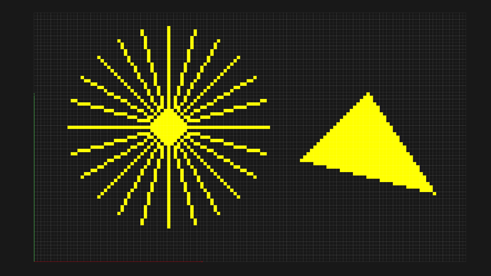

# Computer Graphics 

Computer Graphics @ LMU Munich Summer Semester 2021

- Homepage: [https://mimuc.de/cg1](http://mimuc.de/cg1)
- Responsible Professor: [Prof. Dr. Butz](https://www.medien.ifi.lmu.de/team/andreas.butz/)
- Tutorial Instructor: [Changkun Ou](https://www.medien.ifi.lmu.de/team/changkun.ou/), ~~Florian Lang~~, [David Englmeier](https://www.medien.ifi.lmu.de/team/david.englmeier/)

## Toolkits

We will introduce and use the following toolkits for this course:

- [Node.js](https://nodejs.org/en/): 14.16.0+
- [VSCode](https://code.visualstudio.com/): latest download
- [Blender](https://www.blender.org/): 2.92+

It is recommended for you to install and take a glance at these tools beforehand.

## Lecture Materials

Released on [LMU Moodle](https://moodle.lmu.de/course/view.php?id=13999).

| # | Date | Slides |
|:-:|:----:|:-------|
|0|  13.04.2021 | [Welcome](https://lmu-munich.zoom.us/j/95046750574) |
|1|  20.04.2021 | [Intro and Motivation](https://moodle.lmu.de/mod/lesson/view.php?id=740736) |
|2|  27.04.2021 | [Transformations and Scene Graphs](https://moodle.lmu.de/mod/lesson/view.php?id=769404) |
|3|  04.05.2021 | [3D Geometry and Modeling](https://moodle.lmu.de/mod/lesson/view.php?id=775858) |
|4|  11.05.2021 | [3D Camera](https://moodle.lmu.de/mod/lesson/view.php?id=789730) |
|5|  18.05.2021 | [Rasterization](https://moodle.lmu.de/mod/lesson/view.php?id=793902) |
|6|  01.06.2021 | [Light, Materials, Appearance](https://moodle.lmu.de/mod/lesson/view.php?id=812253) |
|7|  08.06.2021 | [Shading and Rendering](https://moodle.lmu.de/mod/lesson/view.php?id=817646) |
|8|  15.06.2021 | [Animation](https://moodle.lmu.de/mod/lesson/view.php?id=821367) |
|9|  29.06.2021 | [Interaction in 3D](https://moodle.lmu.de/mod/lesson/view.php?id=831621) |

## Tutorial Materials

The following table shows the syllabus of the tutorials:

| # | Date | Slides | Demo |
|:-:|:----:|:-------|:-----:|
|0|  14.04/15.04 | [Organization](https://changkun.de/s/cg1ss21-organize) | - |
|1|  21.04/22.04 | [Introduction](https://changkun.de/s/cg1ss21-intro) |  [Setup](https://mimuc.github.io/cg1/ss21/01-intro/1-setup/), [Basic](https://mimuc.github.io/cg1/ss21/01-intro/2-basic/) |
|2|  28.04/29.04 | [Transformations](https://changkun.de/s/cg1ss21-transform) |  [Tinman](https://mimuc.github.io/cg1/ss21/02-transform/1-wichtelsolo)|
|3|  05.05/06.05 | [Geometry](https://changkun.de/s/cg1ss21-geometry) |  [Bezier](https://mimuc.github.io/cg1/ss21/03-geometry/1-bezier/), [BufferGeometry](https://mimuc.github.io/cg1/ss21/03-geometry/2-buffers/), [Mesh Sampling](https://mimuc.github.io/cg1/ss21/03-geometry/3-sampling/) |
|4|  12.05/13.05 | [Camera](https://changkun.de/s/cg1ss21-camera) |  [Scene Graph](https://mimuc.github.io/cg1/ss21/04-camera/1-models/), [Cameras](https://mimuc.github.io/cg1/ss21/04-camera/2-cameras/), [Dolly Zoom](https://mimuc.github.io/cg1/ss21/04-camera/3-dolly/) |
|5|  19.05/20.05 | [Rasterization-1](https://changkun.de/s/cg1ss21-raster1) |  [Z-fighting](https://mimuc.github.io/cg1/ss21/05-raster1/1-zfighting/), [Drawing](https://mimuc.github.io/cg1/ss21/05-raster1/2-bresenham/) |
|6|  02.06/03.06 | [Rasterization-2](https://changkun.de/s/cg1ss21-raster2) |  [Drawing](https://mimuc.github.io/cg1/ss21/06-raster2/1-draw/), [GLSL](https://mimuc.github.io/cg1/ss21/06-raster2/2-glsl/), [Shaders](https://mimuc.github.io/cg1/ss21/06-raster2/3-shaders/) |
|7|  09.06/10.06 | [Texture](https://changkun.de/s/cg1ss21-texture) |  |
|8|  16.06/17.06 | [Shading](https://changkun.de/s/cg1ss21-shade) |  |

### Assignments

Released on [Uni2Work](https://uni2work.ifi.lmu.de/course/S21/IfI/CG1/sheet).

| # | Submission Period | Assignments | Solution Discussion |
|:--|:-----:|:------------|:-----------|
| 1 | 30.04 - 04.05 | [Transformation](https://uni2work.ifi.lmu.de/course/S21/IfI/CG1/sheet/Graded%20Assignment%201:%20Transformations/show) | in Tutorial 3 |
| 2 | 07.05 - 14.05 | [Mesh](https://uni2work.ifi.lmu.de/course/S21/IfI/CG1/sheet/Graded%20Assignment%202:%20Mesh/show) | in Tutorial 5 |
| 3 | 17.05 - 26.05 | [Camera](https://uni2work.ifi.lmu.de/course/S21/IfI/CG1/sheet/Graded%20Assignment%203:%20Camera/show) | in Tutorial 6 |
| 4 | 28.05 - 06.06 | [Rasterization](https://uni2work.ifi.lmu.de/course/S21/IfI/CG1/sheet/Graded%20Assignment%204:%20Rasterization/show) | in Tutorial 7 |
| 5 | 14.06 - 25.06 | [Material](https://uni2work.ifi.lmu.de/course/S21/IfI/CG1/sheet/Graded%20Assignment%205:%20Material/show) | No Discussion |
| 6 | 28.06 - 04.07 | [Illumination]([./assignments/06-illumination/README.pdf](https://uni2work.ifi.lmu.de/course/S21/IfI/CG1/sheet/Graded%20Assignment%206:%20Illumination/show)) | No Discussion |

## Discussion

General discussions regarding the tutorial are held on [LMU Moodle](https://moodle.lmu.de/mod/forum/view.php?id=678873). But it is welcome for you to fire an [issue](https://github.com/mimuc/cg1/issues/new) directly on GitHub.

## Contribution

It is welcome to send a [pull request](https://github.com/mimuc/cg1/pulls) if you found the provided materials can be improved.

## License

Copyright &copy; 2021 GNU GPLv3. Created by [Changkun Ou](https://changkun.de), ~~Florian Lang~~ [David Englmeier](https://www.medien.ifi.lmu.de/team/david.englmeier/), and [Andreas Butz](http://butz.org)
